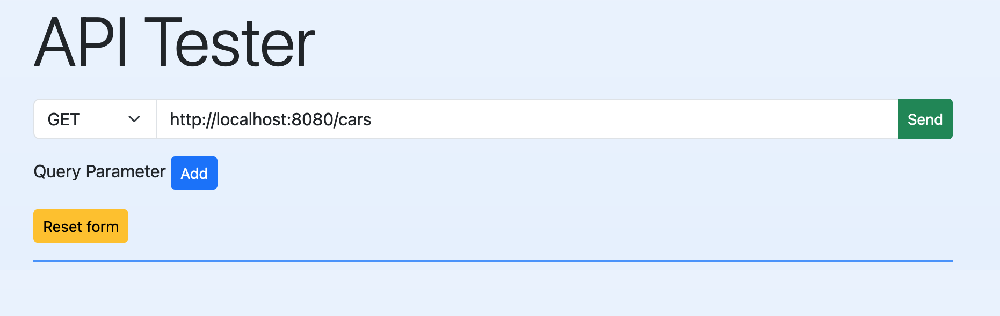
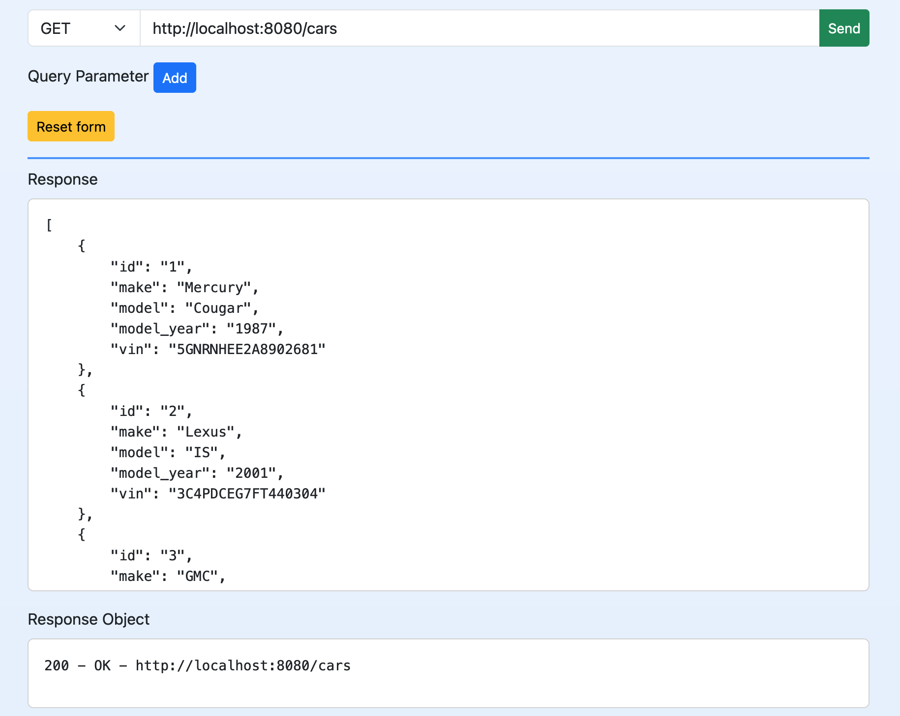
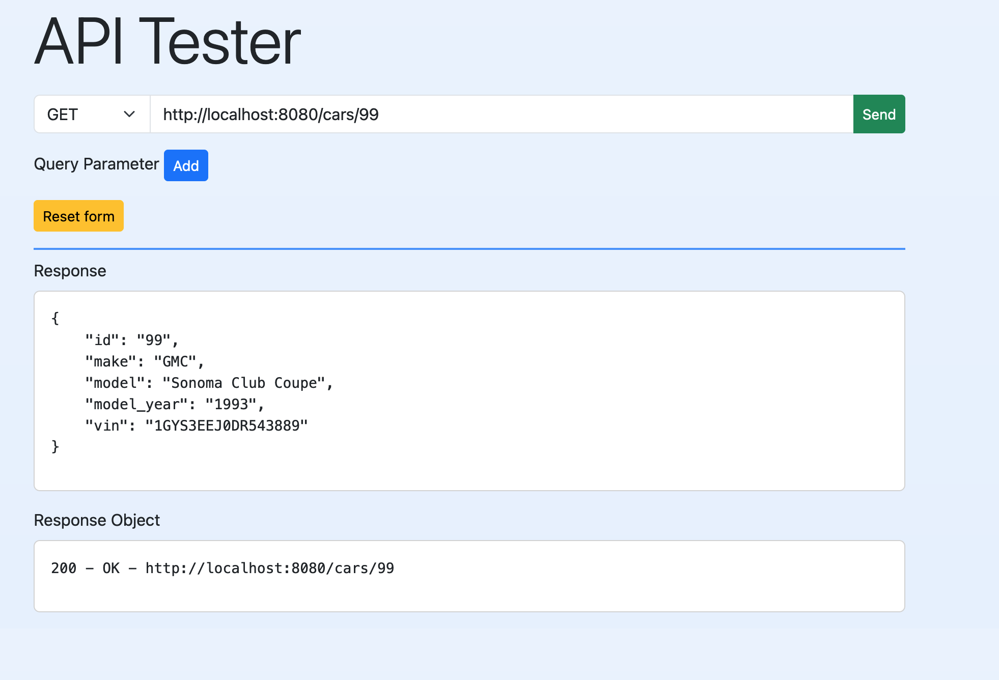
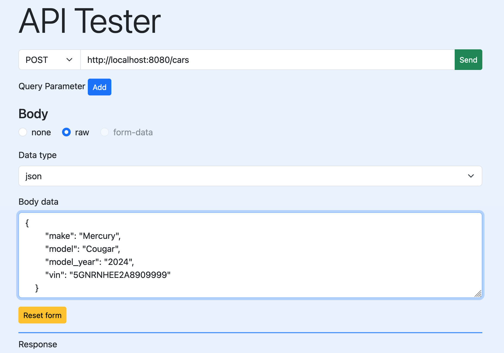

# codeigniter-api-tester
HTML + CSS + JavaScript + PHP + Bootsrap + Alpine.js + CodeIgniter4       
A little web app to test a restful api. There's also an rest api about cars. You can call it by the route /cars.    
GET /cars    
GET /cars/3    
POST /cars add JSON object    
PUT/PATCH /cars/99 add JSON object   
DELETE /cars/1

Images:    
    
    
    
    
    
    
To do:    
* refactor code    
* add documentation    
...    
